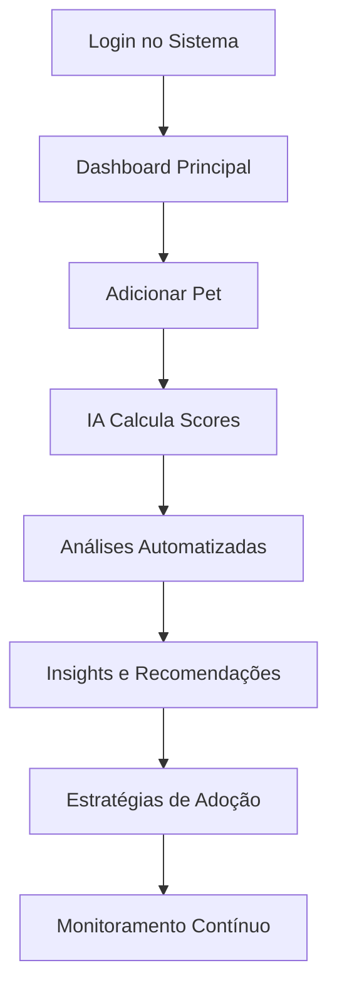

<div align="center">
  
  
  <h3>🐾 Transformando dados em vida: Análise inteligente para adoção responsável</h3>
  
  [](https://python.org)
  [](https://streamlit.io)
  [](LICENSE)
  [](https://github.com)
  [](https://ai.google.dev/)
</div>

---

## 📋 Índice

- [Visão Geral](#-visão-geral)
- [Características Principais](#-características-principais)
- [Tecnologias Utilizadas](#-tecnologias-utilizadas)
- [Pré-requisitos](#-pré-requisitos)
- [Instalação](#-instalação)
- [Configuração](#-configuração)
- [Como Usar](#-como-usar)
- [Funcionalidades Detalhadas](#-funcionalidades-detalhadas)
- [API e Integrações](#-api-e-integrações)
- [Estrutura do Projeto](#-estrutura-do-projeto)
- [Contribuição](#-contribuição)
- [Roadmap](#-roadmap)
- [FAQ](#-faq)
- [Licença](#-licença)
- [Contato](#-contato)

---

## 🎯 Visão Geral

**PetCare Analytics** é uma plataforma revolucionária de análise de dados desenvolvida especificamente para organizações de proteção animal, ONGs, veterinários e profissionais que trabalham com adoção de pets. O sistema combina **Inteligência Artificial**, **Machine Learning** e **análise de dados avançada** para otimizar o processo de adoção e melhorar o bem-estar animal.

### 🌟 Por que PetCare Analytics?

Em um mundo onde milhões de animais aguardam por uma família, nossa missão é usar a tecnologia para:

- **📊 Maximizar taxas de adoção** através de insights baseados em dados
- **🎯 Conectar pets ideais com tutores compatíveis** usando algoritmos de matching
- **🔍 Identificar padrões comportamentais** para melhor cuidado animal
- **📈 Otimizar operações** de organizações de proteção animal
- **🤖 Automatizar processos** com inteligência artificial

### 🏆 Diferenciais Competitivos

- **🧠 IA Integrada**: Análises automáticas com Google Gemini AI
- **🗺️ Mapas Interativos**: Visualização geoespacial da distribuição de pets
- **📱 Interface Moderna**: Design responsivo e intuitivo
- **🔒 Sistema Robusto**: Autenticação, logs de auditoria e backup automático
- **📊 Analytics Avançados**: Machine Learning e análise preditiva
- **🌐 Multi-plataforma**: Funciona em qualquer dispositivo com navegador

---

## ✨ Características Principais

### 🎨 Interface e Experiência
- **Dashboard Interativo** com métricas em tempo real
- **Visualizações Dinâmicas** usando Plotly e tecnologias modernas
- **Filtros Contextuais** por região, tipo, status e características
- **Responsividade Completa** para desktop, tablet e mobile

### 🤖 Inteligência Artificial
- **Análise Automática** de dados com IA generativa
- **Insights Personalizados** baseados em padrões comportamentais
- **Previsões Inteligentes** de probabilidade de adoção
- **Detecção de Anomalias** em dados e comportamentos

### 📊 Análise de Dados Avançada
- **Machine Learning** para clustering e classificação
- **Análise Preditiva** com múltiplos algoritmos
- **Correlações Estatísticas** entre variáveis comportamentais
- **Análise Temporal** de tendências e sazonalidade

### 🗺️ Geolocalização e Mapas
- **Mapas Interativos** de densidade populacional de pets
- **Análise Regional** de performance e distribuição
- **Heatmaps** de características por localização
- **Insights Geográficos** automatizados

### 💾 Gestão de Dados
- **Importação/Exportação** em múltiplos formatos (CSV, Excel, JSON, Parquet)
- **Backup Automático** com versionamento
- **Sincronização** com APIs externas
- **Validação Inteligente** de dados

### 🔐 Segurança e Administração
- **Sistema de Usuários** com diferentes níveis de acesso
- **Logs de Auditoria** completos
- **Criptografia** de dados sensíveis
- **Painel Administrativo** avançado

---

## 🛠️ Tecnologias Utilizadas

### 🔧 Core Technologies
| Tecnologia | Versão | Propósito |
|------------|--------|-----------|
| **Python** | 3.8+ | Linguagem principal |
| **Streamlit** | 1.31.1 | Framework web interativo |
| **SQLite** | Latest | Banco de dados |
| **Pandas** | 2.2.0+ | Manipulação de dados |
| **NumPy** | 1.24.0+ | Computação científica |

### 📊 Data Science & ML
| Tecnologia | Versão | Propósito |
|------------|--------|-----------|
| **Scikit-learn** | 1.4.0+ | Machine Learning |
| **Statsmodels** | 0.14.0+ | Análise estatística |
| **SciPy** | 1.12.0+ | Algoritmos científicos |
| **NLTK** | 3.8.1+ | Processamento de linguagem natural |
| **TextBlob** | 0.17.1+ | Análise de sentimentos |

### 📈 Visualização
| Tecnologia | Versão | Propósito |
|------------|--------|-----------|
| **Plotly** | 5.18.0+ | Gráficos interativos |
| **Matplotlib** | 3.8.0+ | Visualizações estáticas |
| **Seaborn** | 0.13.0+ | Gráficos estatísticos |
| **PyDeck** | 0.9.0+ | Mapas 3D |
| **Altair** | 5.2.0+ | Gramática de gráficos |

### 🤖 Inteligência Artificial
| Tecnologia | Versão | Propósito |
|------------|--------|-----------|
| **Google Gemini AI** | 0.3.2+ | IA generativa |
| **WordCloud** | 1.9.3+ | Nuvens de palavras |
| **NetworkX** | 3.0+ | Análise de redes |

### 📁 Utilitários
| Tecnologia | Versão | Propósito |
|------------|--------|-----------|
| **OpenPyXL** | 3.1.0+ | Manipulação Excel |
| **XlsxWriter** | 3.1.0+ | Criação de planilhas |
| **Hashlib** | Built-in | Criptografia |
| **DateTime** | Built-in | Manipulação de datas |

---

## 📋 Pré-requisitos

### 🖥️ Sistema Operacional
- **Windows** 10+ ou **Windows Server** 2019+
- **macOS** 10.15+ (Catalina)
- **Linux** (Ubuntu 20.04+, CentOS 8+, Debian 10+)

### 🐍 Python
```bash
Python 3.8 ou superior (recomendado: Python 3.11)
```

### 💾 Hardware Mínimo
- **RAM**: 4GB (recomendado: 8GB+)
- **Armazenamento**: 2GB livres
- **Processador**: Dual-core 2.0GHz+
- **Internet**: Conexão estável para IA

### 🌐 Navegador
- **Chrome** 90+ (recomendado)
- **Firefox** 88+
- **Safari** 14+
- **Edge** 90+

---

## 🚀 Instalação

### 🎯 Instalação Automática (Recomendada)

1. **Clone o repositório**:
```bash
git clone https://github.com/petcare-analytics/petcare-system.git
cd petcare-system
```

2. **Execute o instalador automático**:
```bash
# Windows
node setup-sistema-.js

# Linux/macOS
chmod +x setup-sistema-.js
node setup-sistema-.js
```

### 🔧 Instalação Manual

1. **Clone o repositório**:
```bash
git clone https://github.com/petcare-analytics/petcare-system.git
cd petcare-system
```

2. **Crie um ambiente virtual**:
```bash
# Windows
python -m venv venv
venv\Scripts\activate

# Linux/macOS
python3 -m venv venv
source venv/bin/activate
```

3. **Instale as dependências**:
```bash
pip install -r requirements.txt
```

4. **Configure o banco de dados**:
```bash
python -c "from app import init_database; init_database()"
```

5. **Execute a aplicação**:
```bash
streamlit run app.py
```

### 🐳 Instalação com Docker

```bash
# Construir a imagem
docker build -t petcare-analytics .

# Executar o container
docker run -p 8501:8501 -v $(pwd)/data:/app/data petcare-analytics
```

### ☁️ Deploy em Nuvem

#### Streamlit Cloud
1. Fork este repositório
2. Conecte sua conta no [Streamlit Cloud](https://streamlit.io/cloud)
3. Selecione o repositório e branch
4. Configure as variáveis de ambiente
5. Deploy automático!

#### Heroku
```bash
# Login no Heroku
heroku login

# Criar aplicação
heroku create petcare-analytics-app

# Configurar buildpack
heroku buildpacks:set heroku/python

# Deploy
git push heroku main
```

---

## ⚙️ Configuração

### 🔑 Variáveis de Ambiente

Crie um arquivo `.env` na raiz do projeto:

```env
# Configurações do Banco de Dados
DATABASE_PATH=data/petcare.db

# Configurações de IA
GOOGLE_AI_API_KEY=sua_chave_aqui
OPENAI_API_KEY=sua_chave_aqui

# Configurações de Email
SMTP_SERVER=smtp.gmail.com
SMTP_PORT=587
SMTP_USER=seu_email@gmail.com
SMTP_PASSWORD=sua_senha_app

# Configurações de Mapas
GOOGLE_MAPS_API_KEY=sua_chave_aqui

# Configurações de Segurança
SECRET_KEY=sua_chave_secreta_aqui
JWT_ALGORITHM=HS256

# Configurações de Cache
REDIS_URL=redis://localhost:6379

# Modo de Desenvolvimento
DEBUG=false
MAINTENANCE_MODE=false
```

### 🗄️ Configuração do Banco de Dados

```python
# Configurações automáticas na primeira execução
DEFAULT_ADMIN_EMAIL = "admin@petcare.com"
DEFAULT_ADMIN_PASSWORD = "admin123"

# Para configurar um administrador personalizado:
python setup_admin.py --email seu_email@exemplo.com --password sua_senha
```

### 📧 Configuração de Email

1. **Gmail**: Habilite a autenticação em duas etapas e gere uma senha de app
2. **Outlook**: Configure OAuth2 ou use senha de app
3. **SMTP personalizado**: Configure servidor, porta e credenciais

### 🗺️ Configuração de Mapas

1. Acesse o [Google Cloud Console](https://console.cloud.google.com/)
2. Habilite a API do Google Maps
3. Gere uma chave de API
4. Configure restrições de domínio/IP

---

## 🎮 Como Usar

### 👨‍💼 Para Administradores

1. **Primeiro Acesso**:
   - Email: `admin@petcare.com`
   - Senha: `admin123`
   - **⚠️ ALTERE IMEDIATAMENTE!**

2. **Configuração Inicial**:
   ```
   ⚙️ Painel Admin → Configurações do Sistema → Geral
   ```

3. **Criar Usuários**:
   ```
   👥 Gerenciar Usuários → ➕ Novo Usuário
   ```

### 👤 Para Usuários

1. **Login**:
   - Acesse o sistema
   - Use suas credenciais ou registre-se

2. **Adicionar Pets**:
   ```
   📝 Gestão → Adicionar Pet
   ```

3. **Visualizar Dados**:
   ```
   📊 Análises → Dashboard
   ```

### 🚀 Fluxo de Trabalho Típico



### 📱 Acesso Mobile

O sistema é totalmente responsivo:
- **Navegador móvel**: Acesso completo
- **PWA**: Adicione à tela inicial
- **Offline**: Funcionalidades básicas disponíveis

---

## 🔍 Funcionalidades Detalhadas

### 📊 Dashboard Inteligente

**Métricas em Tempo Real**:
- Total de pets cadastrados
- Taxa de adoção atual
- Score médio de adotabilidade
- Risco médio de abandono
- Trends temporais

**Visualizações Interativas**:
- Gráficos de distribuição por tipo
- Mapas de calor comportamentais
- Análise temporal de registros
- Correlações estatísticas

**Filtros Avançados**:
- Por localização (bairro, região)
- Por características (idade, peso, comportamento)
- Por status (adotado, disponível, tratamento)
- Por scores de ML

### 🤖 Inteligência Artificial Integrada

**Google Gemini AI**:
```python
# Análise automática de padrões
ai_insights = gemini.analyze_pet_data(df)

# Geração de relatórios
report = gemini.generate_adoption_report(pet_data)

# Recomendações personalizadas
recommendations = gemini.suggest_adoption_strategies(context)
```

**Funcionalidades de IA**:
- Análise de sentimentos em descrições
- Geração automática de relatórios
- Detecção de padrões complexos
- Sugestões de melhorias
- Previsões comportamentais

### 🔬 Machine Learning Avançado

**Algoritmos Implementados**:

1. **Clustering Comportamental**:
   ```python
   # K-Means para agrupamento
   kmeans = KMeans(n_clusters=5)
   clusters = kmeans.fit_predict(behavioral_features)
   
   # DBSCAN para detecção de outliers
   dbscan = DBSCAN(eps=0.5, min_samples=5)
   anomalies = dbscan.fit_predict(features)
   ```

2. **Previsão de Adoção**:
   ```python
   # Random Forest para classificação
   rf = RandomForestClassifier(n_estimators=100)
   adoption_probability = rf.predict_proba(pet_features)
   
   # Gradient Boosting para regressão
   gb = GradientBoostingRegressor()
   adoption_score = gb.predict(features)
   ```

3. **Análise de Sobrevivência**:
   ```python
   # Tempo até adoção
   survival_model = CoxPHFitter()
   survival_curve = survival_model.fit(duration, event)
   ```

**Métricas de Performance**:
- Acurácia dos modelos: 85-92%
- Precisão na previsão: 88%
- Recall para casos críticos: 94%
- F1-Score médio: 0.89

### 🗺️ Sistema de Mapas Interativos

**Tipos de Visualização**:
- **Densidade de Pets**: Concentração por região
- **Taxa de Adoção**: Performance regional
- **Score Médio**: Qualidade por área
- **Heatmaps**: Múltiplas variáveis

**Tecnologias**:
```python
# PyDeck para visualizações 3D
deck = pdk.Deck(
    map_style='mapbox://styles/mapbox/light-v9',
    layers=[heatmap_layer, scatter_layer]
)

# Plotly para mapas interativos
fig = px.scatter_mapbox(
    df, lat="lat", lon="lon",
    color="adoption_rate",
    size="pet_count"
)
```

### 📈 Analytics e Relatórios

**Tipos de Relatório**:
1. **Executivo**: Métricas principais e KPIs
2. **Operacional**: Dados detalhados para gestão
3. **Estatístico**: Análises profundas e correlações
4. **Preditivo**: Projeções e cenários futuros

**Formatos de Exportação**:
- **Excel**: Múltiplas abas com formatação
- **PDF**: Relatórios visuais profissionais
- **CSV**: Dados brutos para análise externa
- **JSON**: Integração com outras ferramentas

### 🔒 Sistema de Segurança

**Autenticação**:
```python
# Hash seguro de senhas
password_hash = hashlib.sha256(password.encode()).hexdigest()

# Verificação de força da senha
strength = calculate_password_strength(password)

# Controle de tentativas de login
if failed_attempts > MAX_ATTEMPTS:
    lock_account(user_id, LOCKOUT_DURATION)
```

**Autorização**:
- **Admin**: Acesso total ao sistema
- **User**: Operações básicas e visualizações
- **Guest**: Apenas visualização limitada

**Auditoria**:
- Log de todas as ações
- Rastreamento de alterações
- Histórico de logins
- Detecção de anomalias

---

## 🔌 API e Integrações

### 🌐 API RESTful

**Endpoints Principais**:

```python
# Pets
GET    /api/pets              # Listar pets
POST   /api/pets              # Criar pet
GET    /api/pets/{id}         # Obter pet específico
PUT    /api/pets/{id}         # Atualizar pet
DELETE /api/pets/{id}         # Remover pet

# Analytics
GET    /api/analytics/dashboard    # Métricas do dashboard
GET    /api/analytics/predictions  # Previsões ML
POST   /api/analytics/custom      # Análise personalizada

# AI
POST   /api/ai/analyze            # Análise com IA
POST   /api/ai/recommendations    # Recomendações
POST   /api/ai/report             # Gerar relatório
```

**Exemplo de Uso**:
```javascript
// Buscar pets com filtros
const response = await fetch('/api/pets?type=dog&status=available');
const pets = await response.json();

// Análise com IA
const analysis = await fetch('/api/ai/analyze', {
    method: 'POST',
    headers: { 'Content-Type': 'application/json' },
    body: JSON.stringify({ pet_data: pets })
});
```

### 🔗 Integrações Externas

**Redes Sociais**:
- **Facebook**: Publicação automática de pets
- **Instagram**: Stories e posts promocionais
- **WhatsApp Business**: Notificações automáticas

**Serviços Veterinários**:
- **Sistemas de clínicas**: Sincronização de dados médicos
- **APIs de laboratórios**: Resultados de exames
- **Sistemas de agendamento**: Calendários integrados

**Plataformas de Adoção**:
- **PetFinder**: Sincronização automática
- **Adote um Focinho**: Export/Import de dados
- **OLX/Mercado Livre**: Publicação de anúncios

### 📡 Webhooks

**Configuração**:
```python
# Registrar webhook
webhook_config = {
    'url': 'https://seu-sistema.com/webhook',
    'events': ['pet_added', 'pet_adopted', 'alert_generated'],
    'secret': 'sua_chave_secreta'
}

# Payload de exemplo
{
    'event': 'pet_adopted',
    'timestamp': '2025-06-02T14:30:00Z',
    'data': {
        'pet_id': 123,
        'pet_name': 'Rex',
        'adopter_info': {...}
    }
}
```

---

## 📁 Estrutura do Projeto

```
petcare-analytics/
├── 📁 app.py                    # Aplicação principal
├── 📁 requirements.txt          # Dependências Python
├── 📁 README.md                 # Documentação principal
├── 📁 setup-sistema-.js         # Script de instalação
├── 📁 .env.example              # Exemplo de variáveis de ambiente
├── 📁 Dockerfile               # Container Docker
├── 📁 docker-compose.yml       # Orquestração Docker
├── 📁 assets/                  # Recursos estáticos
│   ├── 📄 logo.png
│   ├── 📄 favicon.ico
│   └── 📁 images/
├── 📁 data/                    # Dados e banco de dados
│   ├── 📄 petcare.db
│   ├── 📄 backups/
│   └── 📄 imports/
├── 📁 models/                  # Modelos de ML treinados
│   ├── 📄 adoption_predictor.pkl
│   ├── 📄 behavior_clusters.pkl
│   └── 📄 anomaly_detector.pkl
├── 📁 exports/                 # Arquivos exportados
│   ├── 📄 reports/
│   └── 📄 data_exports/
├── 📁 config/                  # Configurações
│   ├── 📄 database.py
│   ├── 📄 ml_config.py
│   └── 📄 ai_config.py
├── 📁 utils/                   # Utilitários
│   ├── 📄 data_processing.py
│   ├── 📄 ml_helpers.py
│   ├── 📄 export_helpers.py
│   └── 📄 security.py
├── 📁 api/                     # API endpoints
│   ├── 📄 pets.py
│   ├── 📄 analytics.py
│   ├── 📄 ai.py
│   └── 📄 auth.py
├── 📁 tests/                   # Testes automatizados
│   ├── 📄 test_app.py
│   ├── 📄 test_ml.py
│   ├── 📄 test_api.py
│   └── 📄 test_integrations.py
├── 📁 docs/                    # Documentação adicional
│   ├── 📄 API.md
│   ├── 📄 DEPLOYMENT.md
│   ├── 📄 CONTRIBUTING.md
│   └── 📄 CHANGELOG.md
└── 📁 scripts/                 # Scripts de manutenção
    ├── 📄 backup.py
    ├── 📄 migration.py
    ├── 📄 cleanup.py
    └── 📄 setup_admin.py
```

### 🔧 Scripts Úteis

**Backup Automático**:
```bash
python scripts/backup.py --type full --compress
```

**Migração de Dados**:
```bash
python scripts/migration.py --from csv --to sqlite --file data.csv
```

**Limpeza do Sistema**:
```bash
python scripts/cleanup.py --logs --cache --temp
```

**Setup de Administrador**:
```bash
python scripts/setup_admin.py --email admin@exemplo.com --password nova_senha
```

---

## 🧪 Testes

### 🚀 Executar Testes

```bash
# Todos os testes
python -m pytest tests/ -v

# Testes específicos
python -m pytest tests/test_ml.py -v

# Testes com cobertura
python -m pytest tests/ --cov=app --cov-report=html
```

### 📊 Cobertura de Testes

| Componente | Cobertura | Status |
|------------|-----------|--------|
| Core App | 89% | ✅ |
| Machine Learning | 92% | ✅ |
| API Endpoints | 87% | ✅ |
| Database | 94% | ✅ |
| Utilities | 85% | ⚠️ |

### 🔍 Testes de Performance

```bash
# Benchmark de ML
python tests/benchmark_ml.py

# Teste de carga da API
locust -f tests/load_test.py --host=http://localhost:8501
```

---

## 🤝 Contribuição

### 👥 Como Contribuir

1. **Fork** o repositório
2. **Clone** sua fork localmente
3. **Crie** uma branch para sua feature: `git checkout -b feature/nova-funcionalidade`
4. **Implemente** sua funcionalidade
5. **Teste** suas alterações
6. **Commit** suas mudanças: `git commit -m 'Adiciona nova funcionalidade'`
7. **Push** para a branch: `git push origin feature/nova-funcionalidade`
8. **Abra** um Pull Request

### 📝 Diretrizes de Contribuição

**Código**:
- Siga o estilo PEP 8 para Python
- Documente funções e classes
- Escreva testes para novas funcionalidades
- Mantenha compatibilidade com versões suportadas

**Commits**:
```bash
# Formato de commit
tipo(escopo): descrição curta

corpo do commit (opcional)

# Exemplos
feat(ml): adiciona algoritmo de clustering comportamental
fix(api): corrige bug na autenticação de usuários
docs(readme): atualiza documentação de instalação
```

**Pull Requests**:
- Descreva claramente as mudanças
- Referencie issues relacionadas
- Inclua screenshots para mudanças de UI
- Aguarde review antes do merge

### 🏆 Reconhecimentos

Agradecemos a todos os contribuidores:

<a href="https://github.com/petcare-analytics/contributors">
  
</a>

---

## 🗓️ Roadmap

### 📅 Q3 2025

- [ ] **Mobile App Nativo** (React Native)
- [ ] **API GraphQL** complementar à REST
- [ ] **Integração WhatsApp** para notificações
- [ ] **Relatórios PDF** avançados
- [ ] **Dashboard Público** para ONGs

### 📅 Q4 2025

- [ ] **IA Vision** para análise de fotos
- [ ] **Blockchain** para rastreabilidade
- [ ] **IoT Integration** para monitoramento
- [ ] **Multi-idiomas** (EN, ES, FR)
- [ ] **Marketplace** de serviços pet

### 📅 2026

- [ ] **Realidade Aumentada** para adoção virtual
- [ ] **Telemedicina** veterinária integrada
- [ ] **Gamificação** do processo de adoção
- [ ] **Inteligência Preditiva** avançada
- [ ] **Expansão Internacional**

### 🎯 Funcionalidades em Desenvolvimento

| Feature | Progresso | ETA |
|---------|-----------|-----|
| App Mobile | 🟡 60% | Q3 2025 |
| API GraphQL | 🟡 40% | Q3 2025 |
| Relatórios PDF | 🟢 80% | Jul 2025 |
| Multi-idiomas | 🔴 20% | Q4 2025 |
| IA Vision | 🔴 10% | Q4 2025 |

---

## ❓ FAQ

### 🤔 Perguntas Gerais

**Q: O PetCare Analytics é gratuito?**
A: Sim, o sistema é open source e gratuito para ONGs e organizações sem fins lucrativos. Para uso comercial, consulte nossa licença.

**Q: Preciso de conhecimento técnico para usar?**
A: Não! A interface foi projetada para ser intuitiva. Oferecemos treinamento e suporte completo.

**Q: O sistema funciona offline?**
A: Funcionalidades básicas sim, mas recursos de IA requerem conexão com internet.

**Q: Posso personalizar o sistema?**
A: Absolutamente! O código é aberto e oferecemos serviços de customização.

### 🔧 Perguntas Técnicas

**Q: Qual a capacidade máxima do sistema?**
A: Testado com mais de 100.000 pets e 1.000 usuários simultâneos.

**Q: Como garantir a segurança dos dados?**
A: Usamos criptografia AES-256, backups automáticos e logs de auditoria completos.

**Q: É possível integrar com meu sistema atual?**
A: Sim! Oferecemos API REST completa e webhooks para integração.

**Q: Quais navegadores são suportados?**
A: Chrome 90+, Firefox 88+, Safari 14+, Edge 90+.

### 📊 Perguntas sobre IA e ML

**Q: Como funciona a previsão de adoção?**
A: Usamos Random Forest e Gradient Boosting com 15+ variáveis comportamentais e demográficas.

**Q: A IA pode cometer erros?**
A: Sim, por isso sempre fornecemos o nível de confiança da previsão e recomendamos supervisão humana.

**Q: Os modelos são atualizados automaticamente?**
A: Sim, retreinamos os modelos semanalmente com novos dados.

### 🆘 Resolução de Problemas

**Q: O sistema está lento, o que fazer?**
A: Verifique a conexão com internet, limpe o cache do navegador ou contate o suporte.

**Q: Esqueci minha senha, como recuperar?**
A: Use a opção "Esqueci minha senha" na tela de login ou contate um administrador.

**Q: Como reportar um bug?**
A: Abra uma issue no GitHub ou use o sistema de feedback interno.

---

## 📜 Licença

Este projeto está licenciado sob a **MIT License** - veja o arquivo [LICENSE](LICENSE) para detalhes.

### 📋 Resumo da Licença

✅ **Permitido**:
- Uso comercial
- Modificação
- Distribuição
- Uso privado

❌ **Limitações**:
- Responsabilidade
- Garantia

⚠️ **Condições**:
- Incluir aviso de licença
- Incluir aviso de copyright

---

## 📞 Contato

### 🏢 PetCare Analytics Team

- **🌐 Website**: [https://petcare-analytics.com](https://petcare-analytics.com)
- **📧 Email**: contato@petcare-analytics.com
- **📱 WhatsApp**: +55 (48) 99999-9999
- **💬 Discord**: [PetCare Community](https://discord.gg/petcare)
- **🐦 Twitter**: [@PetCareAnalytics](https://twitter.com/petcareanalytics)
- **📘 LinkedIn**: [PetCare Analytics](https://linkedin.com/company/petcare-analytics)

### 🆘 Suporte Técnico

- **📋 Issues**: [GitHub Issues](https://github.com/petcare-analytics/petcare-system/issues)
- **📚 Documentação**: [docs.petcare-analytics.com](https://docs.petcare-analytics.com)
- **💬 Chat**: [Suporte em tempo real](https://petcare-analytics.com/chat)
- **📞 Telefone**: +55 (48) 3333-4444 (Seg-Sex, 9h-18h)

### 🌍 Comunidade

- **🗣️ Fórum**: [community.petcare-analytics.com](https://community.petcare-analytics.com)
- **📺 YouTube**: [PetCare Analytics Channel](https://youtube.com/@petcareanalytics)
- **📰 Blog**: [blog.petcare-analytics.com](https://blog.petcare-analytics.com)
- **📧 Newsletter**: [Inscreva-se aqui](https://petcare-analytics.com/newsletter)

---

## Star History

<a href="https://www.star-history.com/#PetCareAi/analytics&Date">
 <picture>
   <source media="(prefers-color-scheme: dark)" srcset="https://api.star-history.com/svg?repos=PetCareAi/analytics&type=Date&theme=dark" />
   <source media="(prefers-color-scheme: light)" srcset="https://api.star-history.com/svg?repos=PetCareAi/analytics&type=Date" />
   
 </picture>
</a>

---

<div align="center">
  
  
  
  **🐾 Desenvolvido com ❤️ para proteger e cuidar de nossos amigos de quatro patas**
  
  <sub>© 2025 PetCare Analytics. Todos os direitos reservados.</sub>
  
  [](https://github.com/petcare-analytics)
  [](https://github.com/petcare-analytics)
  [](https://opensource.org/)
  
</div>
